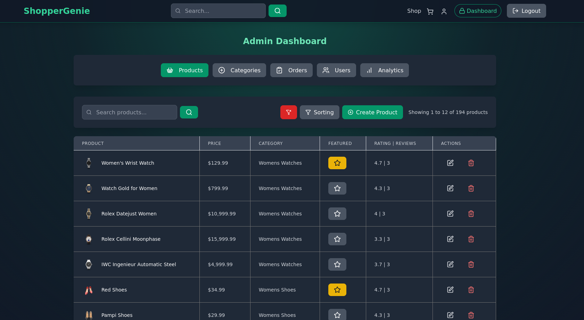
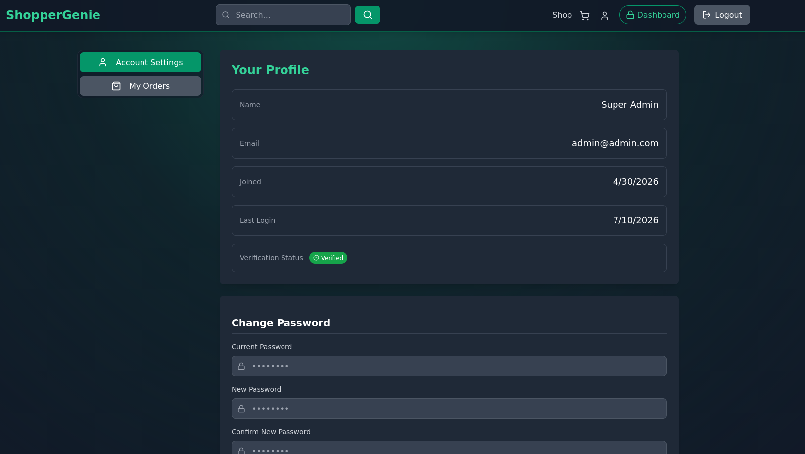
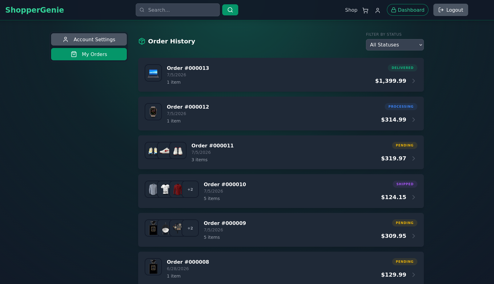
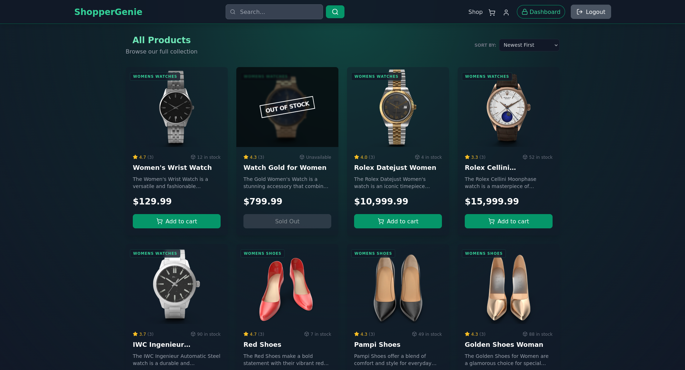
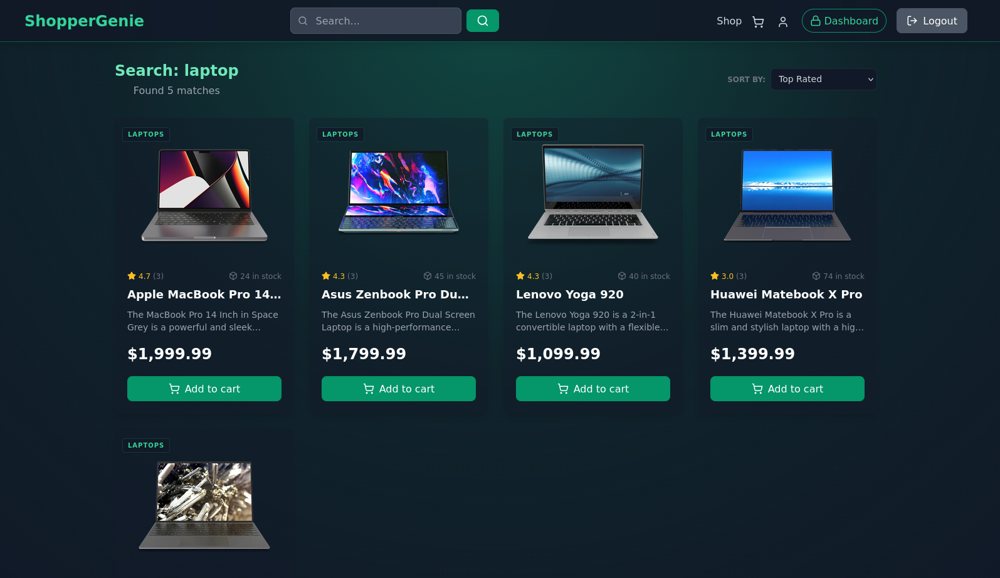
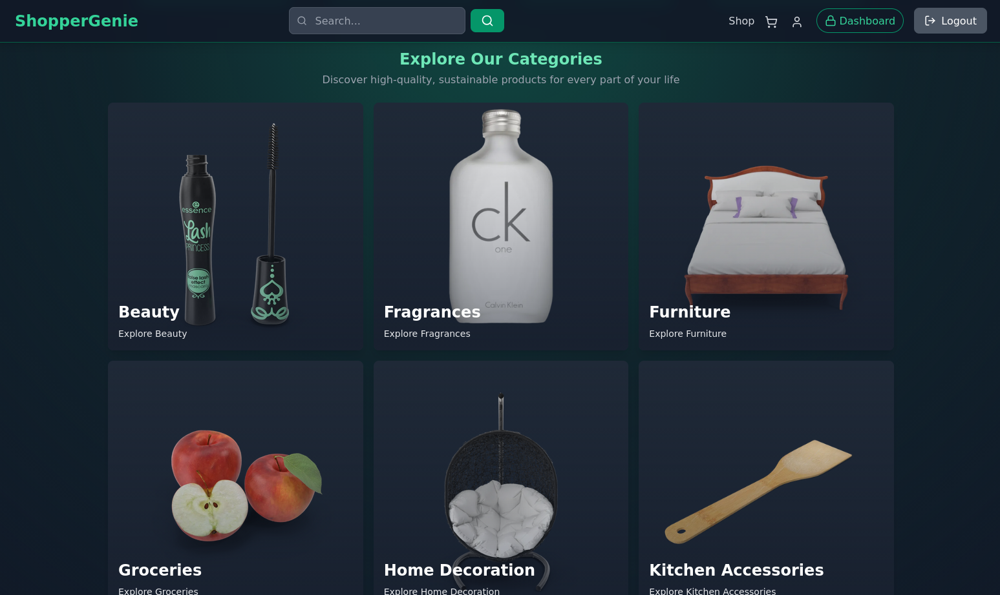
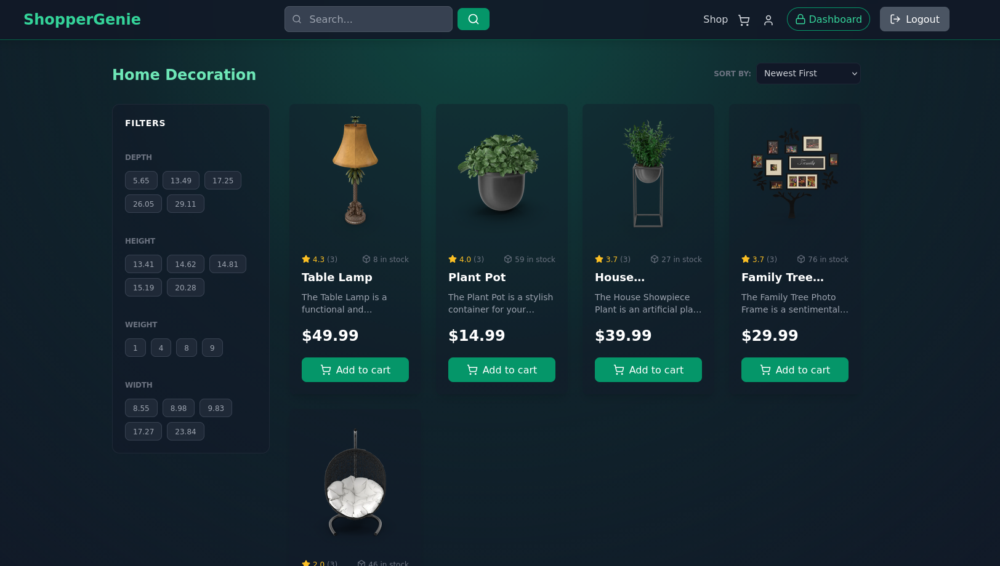

<div align="center">

<a href="https://github.com/artem-mw/e_commerce_store" target="blank">

</a>

<h2>ShopperGenie</h2>

<h3>A robust, production-ready full-stack e-commerce store built with modular architecture and modern development practices.</h3>

**Link to deployed live production: https://shopper-genie.duckdns.org/**


-white?style=for-the-badge&logo=github-actions&logoColor=white&color=gray)
-blue?style=for-the-badge&logo=google-cloud&color=red)

</div>

---

## Table of Contents
* [Overview](#overview)
* [Tech Stack](#tech-stack)
  * [Backend](#tech-stack-backend)
  * [Frontend](#tech-stack-frontend)
  * [Deployment & Infrastructure](#tech-stack-deployment-and-infrastructure)
* [Features](#features)
  * [Authentication & Accounts](#features-authentication-and-accounts)
  * [Catalog](#features-catalog)
  * [Shopping & Checkout](#features-shopping-and-checkout)
  * [Orders](#features-orders)
  * [Coupons](#features-coupons)
  * [Reviews](#features-reviews)
  * [Admin](#features-admin)
* [Gallery](#gallery)
* [Backend Architecture](#backend-architecture)
  * [Dependency Injection](#dependency-injection)
  * [Provider Agnosticism](#backend-provider-agnosticism)
  * [Request Lifecycle](#backend-request-lifecycle)
  * [Error Handling](#backend-error-handling)
  * [Testing](#backend-testing)
  * [Seeders](#backend-seeders)
* [Frontend Architecture](#frontend-architecture)
  * [State Management](#frontend-state-management)
  * [Request Lifecycle](#frontend-request-lifecycle)
* [Implementation Details (Deep dives)](#implementation-details)
  * [Data Model Overview](#implementation-details-data-model-overview)
  * [Authentication Details](#implementation-details-authentication-details)
  * [Payment Flow](#implementation-details-payment-flow)
  * [Order Snapshot Design](#implementation-details-order-snapshot-design)
* [Getting Started](#getting-started)
  * [Prerequisites](#getting-started-prerequisites)
  * [Local Development (Docker Compose + Frontend Dev Server)](#getting-started-local-development)
  * [Local Production (Minikube + Kustomize)](#getting-started-local-production)
* [Deployment](#deployment)
  * [Production Environment](#deployment-production-environment)
  * [Deployment Pipeline](#deployment-deployment-pipeline)
  * [Traffic & Routing](#deployment-traffic-and-routing)
* [License](#license)

---

<a id="overview"></a>
## Overview
This repository hosts a production-ready, full-stack E-Commerce store meticulously crafted with a clean, modular architecture. It implements a layered controller–service–repository pattern, incorporates a custom Dependency Injection (DI) container, and utilizes provider-agnostic interfaces to ensure maintainability, testability, and scalability. Designed to demonstrate best practices in modern web development, this project serves as a comprehensive example for building complex, well-architected applications.

---

<a id="tech-stack"></a>
## Tech Stack

<a id="tech-stack-backend"></a>
### Backend
| Layer             | Technology                        |
|-------------------|-----------------------------------|
| Runtime           | Node.js 24                        |
| Language          | TypeScript (ES modules)           |
| Web App Framework | Express 5                         |
| Database          | MongoDB (Mongoose)                |
| Cache             | Redis (ioredis) or in-memory      |
| Auth              | JWT (HTTP-only cookies), bcryptjs |
| Payments          | Stripe Checkout + webhooks        |
| File storage      | Cloudinary                        |
| Email             | Nodemailer (Gmail) or Mailtrap    |
| Validation        | Joi                               |
| Testing           | Vitest                            |


<a id="tech-stack-frontend"></a>
### Frontend
| Layer            | Technology           |
|------------------|----------------------|
| Framework        | React 19             |
| Language         | JavaScript           |
| Build Tool       | Vite 7               |
| State Management | Zustand 5            |
| HTTP Client      | Axios                |
| Routing          | React Router DOM 7.8 |
| Styling          | Tailwind CSS         |


<a id="tech-stack-deployment-and-infrastructure"></a>
### Deployment & Infrastructure
| Layer             | Technology                       |
|-------------------|----------------------------------|
| Containerization  | Docker                           |
| Orchestration     | Minikube(local), GKE(production) |
| Cloud Provider    | Google Cloud Platform (GKE)      |
| CI/CD             | GitHub Actions                   |
| Local Setup       | Docker Compose + Shell Script    |
| Domain            | DuckDNS                          |

---

<a id="features"></a>
## Features

<a id="features-authentication-and-accounts"></a>
### Authentication & Accounts
- **Signup / Login** with bcrypt password hashing
- **JWT session model**: short-lived access token + long-lived refresh token stored in **HTTP-only cookies**
- **Refresh token rotation** with Redis-backed storage; reuse detection invalidates the session
- **Email verification** on signup (6-digit code via email)
- **Forgot / reset password** flow with expiring tokens
- **Change password** (invalidates cookies on success)
- **Roles**: `customer` and `admin`

<a id="features-catalog"></a>
### Catalog
- **Products** with **Categories**, dynamic attributes (defined per category) images, stock, and rating stats
- **Filtering & pagination** on the public product listing
- **Attribute facets** for category-scoped filter UI
- **Featured products** stored in cache
- **Recommendations** based on cart contents

<a id="features-shopping-and-checkout"></a>
### Shopping & Checkout
- **Per-user cart** (add, update quantity, remove, clear)
- **Checkout** session creation with items built from cart
- **Webhook-driven order finalization** (raw body parsing, separate from global JSON middleware)
- **Stock deduction** on successful payment; falls back to `backorder` status if stock is insufficient
- **Coupon application** at checkout; coupons deactivated after use

<a id="features-orders"></a>
### Orders
- **Status workflow**: `awaiting_payment` → `pending` → `processing` → `shipped` → `delivered` (plus `cancelled`, `backorder`)
- Customers view their own orders; admins manage all orders and update status
- Order lookup by order number and session ID
- Payment status lookup by session ID for polling after checkout

<a id="features-coupons"></a>
### Coupons
- One active coupon per user at a time
- Percentage discount (configurable, default 10%)
- **Auto-grant** a new coupon when a purchase exceeds a minimum threshold (configurable, default $200)
- Validation endpoint for checkout UI

<a id="features-reviews"></a>
### Reviews
- CRUD for authenticated users
- One review per user per product
- Optional **purchase requirement** (configurable via env)

<a id="features-admin"></a>
### Admin
- **Complete dashboard** with full CRUD for master data entities, and state management for transactional records
- **Analytics tab** data: total users, products, sales, revenue, and 7-day daily sales chart
- User statistics endpoint

---

<a id="gallery"></a>
## Gallery

Screenshots and a video of some of the functionality.

**Admin Dashboard**:



**Profile**:




**Catalog**:






**Cart & Checkout flow**:

<video src="./assets/cart_and_checkout.mp4" controls width="100%"></video>
[Download video](./assets/cart_and_checkout.mp4) if video doesn't play.
---

<a id="backend-architecture"></a>
## Backend Architecture
The server follows a **layered architecture with separation of concerns**:

```
Presentation (controllers, routers, validators, middleware)
        ↓
Application (services, DTOs, mappers, repository interfaces)
        ↓
Infrastructure (DB and Cache repositories, Storage, Payment, Email, security, adapters)
```

---

<a id="backend-dependency-injection"></a>
### Dependency Injection
A custom `Container` resolves the full object graph at startup (`core/di/bootstrap.ts`). Registrations are split by concern:
- **Providers** - DB, Cache, Storage, Payment, Email
- **Repositories** - Specific DB implementations + Cache repositories
- **Infrastructure Services** - Common services
- **Storage Services** - Storage per domain
- **Image Managers** - Image Manager per domain
- **Validators** - Entity validators
- **Application Services** - Business logic
- **Cookie Managers** - Cookie Manager per domain
- **Controllers** - HTTP handlers
- **Seeders** - DB seeding

All dependencies are wired explicitly; circular dependencies are detected at resolve time.

---

<a id="backend-provider-agnosticism"></a>
### Provider Agnosticism
Core infrastructure is exposed through interfaces.
Current environment uses:

- **MongoDB Atlas** (swappable via `IDatabaseProvider`)
- **Redis** (or in-memory via `CACHE_TYPE`)
- **Cloudinary** (swappable via `IStorageProvider`)
- **Stripe** (swappable via `IPaymentProvider`)
- **Nodemailer(Gmail) / Mailtrap** (switchable via `EMAIL_TYPE`)

Implementations can be swapped without modifying application logic - enabling easy testing with mocks and seamless migration to alternative providers.

---

<a id="backend-request-lifecycle"></a>
### Request Lifecycle
1. Route matched → Joi validation middleware (where applicable)
2. Auth middleware validates JWT from `accessToken` cookie (protected routes)
3. Controller delegates to an application service
4. Service uses repository interfaces, provider interfaces, their specific helper services, common services etc. to handle the request
5. Errors are mapped to HTTP responses by the global error handler

---

<a id="backend-error-handling"></a>
### Error Handling
Application code throws typed **domain errors** (`EntityNotFoundError`, `ValidationError`, `UnauthenticatedError`, etc.) that the global handler maps to HTTP status codes:

| Error                                  | Status                             |
|----------------------------------------|------------------------------------|
| `EntityNotFoundError`                  | 404                                |
| `EntityAlreadyExistsError`             | 409                                |
| `ValidationError`                      | 400 / 410 (expired)                |
| `UnauthenticatedError`                 | 401                                |
| `UnauthorizedError` / `ForbiddenError` | 403                                |
| `SystemError` or Unhandled             | 500 (message hidden in production) |

---

<a id="backend-testing"></a>
### Testing
**Unit Tests:** Vitest framework
Existing test coverage is minimal and includes:
- `CouponValidator` — Coupon validation rules
- `AuthCacheRepository` — Cache layer operations
- `slug` — Slug sanitization utility

Additionally, the test helper `tests/utils/createMock.ts` provides lightweight mocks for DI.

Run tests:
```bash
npm test           # vitest run
npm run type-check # tsc --noEmit
```

---

<a id="backend-seeders"></a>
### Seeders
On every startup:

1. **AdminSeeder** — creates the default admin user if one doesn't exist (credentials from env)
2. **ProductsDummyJsonSeeder** — optionally fetches products from [DummyJSON](https://dummyjson.com/products) when `SEED_PRODUCTS_ON_STARTUP=true`

---

<a id="frontend-architecture"></a>
## Frontend Architecture
The client implements a feature-driven component model with centralized state management and layered API abstraction:

```
Application Entry (App.jsx, global UI shell)
        ↓
Routing Layer (React Router 7.x with route guards)
        ↓
Pages (route-mounted screens)
        ↓
Feature Components (domain-specific logic)
        ↓
Shared UI (atomic, reusable primitives)
```

---

<a id="frontend-state-management"></a>
### State Management
- **State Management** - Zustand stores organized by domain (auth, cart, products, categories, orders, reviews, users, analytics) with a separate global store for UI-level concerns.
- **Unified store utilities** - Store utilities (handleAsyncAction, handlePaginatedFetch, handleUpdateFilter, etc.) centralize async orchestration including state transitions, filter/pagination composition, and consistent error feedback.
- **Global interceptors** - Axios refresh token queue prevents concurrent refresh storms and handles 401s automatically.

---

<a id="frontend-request-lifecycle"></a>
### Request Lifecycle
1. Route matched → Auth guard checks user + checkingAuth flag
2. Protected routes validate JWT presence before rendering
3. Pages trigger store actions (e.g., fetchProducts, getCartItems)
4. API layer wraps calls with base URL, credentials, and qs serialization for arrays
5. Token expiration handled transparently via Axios interceptor
6. Global error display + toast notifications surface failures to user

---

<a id="implementation-details"></a>
### Implementation Details (Deep dives)

<a id="implementation-details-data-model-overview"></a>
### Data Model Overview
| Collection   | Key fields                                                                                       |
|--------------|--------------------------------------------------------------------------------------------------|
| **User**     | name, email, hashed password, role, isVerified, verification/reset tokens                        |
| **Product**  | name, description, price, stock, images, categoryId, attributes, isFeatured, ratingStats         |
| **Category** | name, slug, description, image, allowedAttributes                                                |
| **Cart**     | userId, items (productId, quantity)                                                              |
| **Order**    | userId, products (snapshot), customerDetails, totalAmount, status, paymentSessionId, orderNumber |
| **Review**   | productId, userId, rating, comment                                                               |
| **Coupon**   | userId, code, discountPercentage, isActive, expiresAt                                            |

Domain **entities** are immutable frozen objects; Mongoose **adapters** map between persistence documents and entities at layer boundaries.

---

<a id="implementation-details-authentication-details"></a>
### Authentication Details
Tokens are delivered as **HTTP-only cookies** (`accessToken`, `refreshToken`), not in response bodies. The frontend must send requests with `credentials: true`.

| Token   | Default TTL | Purpose                   |
|---------|-------------|---------------------------|
| Access  | 15 minutes  | Authenticate API requests |
| Refresh | 7 days      | Obtain new access tokens  |

Refresh tokens are stored in Redis keyed by user ID. On refresh:

1. Stored token must match the cookie (reuse → all sessions invalidated)
2. New token pair is issued (rotation)

Production cookies use `Secure` + `SameSite=None`; development uses `SameSite=Lax`. Set `FORCE_DISABLE_SECURE_COOKIES=true` for local HTTPS-free testing.

Protected routes use `createProtectRoute`; admin routes add `adminRoute`.

---

<a id="implementation-details-payment-flow"></a>
### Payment Flow (Stripe)
Illustrates the order lifecycle using the current `StripeProvider` implementation.
The architecture supports swapping this for any `IPaymentProvider` implementation.

```
Client                    API                          Stripe
  │                        │                              │
  │── POST /payments/      │                              │
  │   create-checkout-     │                              │
  │   session ────────────►│                              │
  │                        │── Create order               │
  │                        │   (awaiting_payment)         │
  │                        │── Create Checkout Session ──►│
  │◄── session URL ────────│                              │
  │                        │                              │
  │── Redirect to Stripe ────────────────────────────────►│
  │                        │                              │
  │                        │◄── webhook: session.completed│
  │                        │── Deduct stock               │
  │                        │── Update order → pending     │
  │                        │── Clear cart                 │
  │                        │── Finalize coupon            │
  │                        │── If threshold met - grant new coupon
```

The webhook route uses `express.raw()` for Stripe signature verification and is mounted **before** the global JSON parser.

---

<a id="implementation-details-order-snapshot-design"></a>
### Order Snapshot Design
Orders store product data as **snapshots** at time of purchase, not references:

`OrderEntity.products = [{ id, quantity, price, name, image }]`

This ensures:
- Historical accuracy if catalog changes post-purchase
- Price disputes resolved against original order state
- Audit trail independent of product lifecycle

---

<a id="getting-started"></a>
## Getting Started
Running natively (without Docker or Minikube) is possible but requires manual setup of external services. The recommended and most seamless way is to use `docker-compose.yml` for development or `setup-minikube.sh` for production-like testing.

---

<a id="getting-started-prerequisites"></a>
### Prerequisites
- Node.js 24+
- MongoDB Atlas
- Redis
- Cloudinary account
- Stripe account
- Docker
- Minikube
- Linux or WSL2(if you're on Windows)

**Clone repo**:
```bash
git clone https://github.com/artem-mw/e_commerce_store.git
cd e_commerce_store
```

**Configure Environment Variables**:

Explore, copy and populate with your values
```bash
# In the root
cp .env.example .env

cp backend/.env.example backend/.env

cp frontend/.env.example frontend/.env
cp frontend/.env.development frontend/.env.development
cp frontend/.env.production.example frontend/.env.production
```

---

<a id="getting-started-local-development"></a>
### Local Development (Docker Compose + Frontend Dev Server)
The root `docker-compose.yml` runs the backend API, Redis and Stripe CLI(forwards webhooks automatically).

Start backend services:
```bash
# In the root
docker compose up -d --build
```

Start frontend dev server (separate terminal):
```bash
# In the root
cd frontend
npm run dev
```

- The backend container mounts `./backend` for hot reload and reads `./backend/.env`.
- Frontend also works in hot reload mode. Reads ./frontend/.env + ./frontend/.env.development

Access after build:
- Backend: http://localhost:3001
- Frontend: http://localhost:5173

---

<a id="getting-started-local-production"></a>
### Local Production (Minikube + Kustomize)
For a production-like Kubernetes environment:

```bash
# In the root
chmod +x setup-minikube.sh
./setup-minikube.sh
```

The script handles:
- Minikube cluster startup (if not running)
- Backend/Frontend Docker image builds (production targets)
- Kustomize deployment with local environment overlays
- Automatic rollout verification

Access after deployment:
- Frontend: http://<minikube-ip>:30000
- Backend: http://<minikube-ip>:30001/api

*You don't have to know minikube-ip, you will get URLs in the terminal logs after executing the script.

---

<a id="deployment"></a>
## Deployment

<a id="deployment-production-environment"></a>
### Production Environment
**Live Instance**: https://shopper-genie.duckdns.org/

**Infrastructure**:
- Containerized with Docker multi-stage builds
- Orchestrated on Google Kubernetes Engine (GKE)
- CI/CD pipeline via GitHub Actions
- Load balancer with domain routing via DuckDNS

Infrastructure manifests live in `k8s/` directory; CI/CD pipelines in `.github/workflows/`.

---

<a id="deployment-deployment-pipeline"></a>
### Deployment Pipeline
1. Code push to main branch triggers GitHub Actions workflow
2. Backend/Frontend images built with production targets
3. Images pushed to Google Container Registry
4. Kustomize applies overlays to GKE cluster
5. Rolling deployment with health checks

---

<a id="deployment-traffic-and-routing"></a>
### Traffic & Routing
Production uses GKE-managed Ingress with:

- **Static external IP** — Persistent load balancer address
- **Managed SSL certificate** — Auto-provisioned TLS via GKE ManagedCertificate
- **Path-based routing** — `/api` → Backend (port 3001), `/` → Frontend (port 80)

---

<a id="license"></a>
## License
This project is licensed under the [MIT License](LICENSE.md).